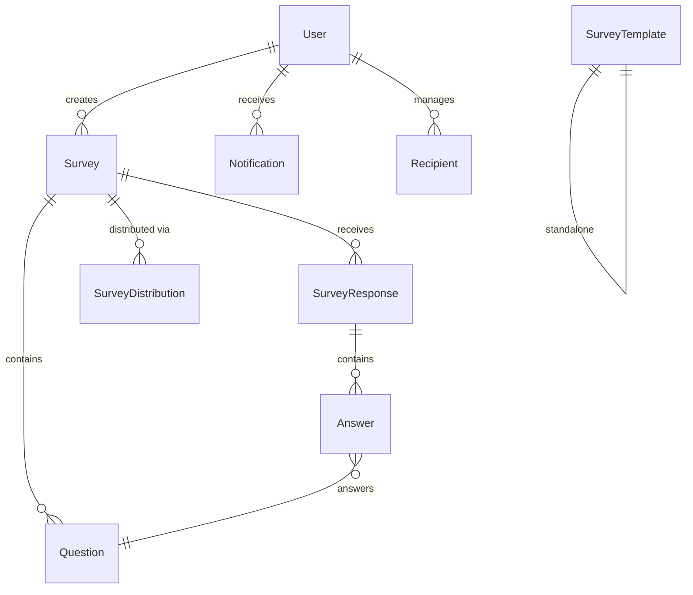

# FeedBack Generator App — Full Project Analysis

## Tech Stack

| Layer | Technology |
|-------|-----------|
| Runtime | .NET 10 / ASP.NET Core Web API |
| Database | SQL Server via Entity Framework Core 10 |
| Auth | JWT Bearer + BCrypt password hashing |
| API Docs | Swashbuckle (Swagger) v6.5.0 |
| Mapping | AutoMapper 12 |
| Architecture | Repository + Service Pattern |

---

## Project Structure (50 files)

```
FeedBackGeneratorApp/
├── Controllers/        (8 files)  — API endpoints
├── Services/           (8 files)  — Business logic
├── Interfaces/         (9 files)  — Contracts
├── Models/             (9 files)  — EF Core entities
├── DTOs/               (9 files)  — Request/Response objects
├── Exceptions/         (2 files)  — Custom error handling
├── Helpers/            (2 files)  — JWT + AutoMapper
├── Repositories/       (1 file)   — Generic repository
├── Contexts/           (1 file)   — DbContext
└── Program.cs                     — App configuration
```

---

## Implemented Features ✅

### 🔐 Authentication & Security
| Feature | Implementation |
|---------|---------------|
| User Registration | BCrypt hashed passwords, duplicate email check |
| User Login | JWT token generation with user claims |
| Role-Based Access | `Admin` / `User` roles via JWT claims |
| Swagger Auth Button | Bearer token integration in Swagger UI |
| Rate Limiting | 100 req/min per user (JWT ID or IP fallback) |
| CORS | Open policy (configurable) |

### 📋 Survey Management
| Feature | Implementation |
|---------|---------------|
| CRUD Operations | Create, Read, Update, Delete surveys |
| Question Types | MultipleChoice, OpenText, Rating, YesNo |
| Survey Versioning | Auto-increments on update |
| Shareable Links | Auto-generated on creation |
| Survey Expiry | `ExpiresAt` field, auto-blocks responses after deadline |
| Question Reuse | `CopyQuestionsFromSurveyId` clones questions from existing survey |
| Response Count | `TotalResponses` returned with every survey |
| Branding Config | JSON field for custom styling |

### 📝 Response Collection
| Feature | Implementation |
|---------|---------------|
| Anonymous Submissions | No login required to fill surveys |
| Required Questions | Validates all required questions are answered |
| Question Validation | Checks answers belong to correct survey |
| Pause/Resume | Save partial responses and complete later |
| Creator Notifications | Auto-notifies survey owner on new response |

### 📊 Analytics
| Feature | Implementation |
|---------|---------------|
| Completion Rate | % of complete vs incomplete responses |
| Answer Distribution | Counts per option for MCQ/YesNo |
| Average Rating | Mean score for Rating questions |
| Open Text Listing | Collects all text responses |

### 📤 Distribution
| Feature | Implementation |
|---------|---------------|
| Link Distribution | Auto-generated shareable URLs |
| QR Code (placeholder) | Stores URL but doesn't generate actual QR image |
| Email (placeholder) | Stores email address but doesn't send |
| Scheduled Sending | `ScheduledAt` field for future distribution |

### 👥 Recipient Management
| Feature | Implementation |
|---------|---------------|
| CRUD Recipients | Add, list, delete recipients |
| Group Organization | Group recipients by `GroupName` |
| Bulk Import | Import multiple recipients at once with validation |
| Duplicate Detection | Prevents duplicate emails per user |

### 🔔 Notifications
| Feature | Implementation |
|---------|---------------|
| In-App Notifications | Created on new response |
| Mark as Read | Individual mark-as-read |
| Unread Count | Quick count endpoint |
| Read/Unread Filter | Filter notifications by status |

### 📄 Templates
| Feature | Implementation |
|---------|---------------|
| Create Templates | Save survey blueprints as JSON |
| Duplicate Name Check | Prevents same-name templates |

### ⚙️ Infrastructure
| Feature | Implementation |
|---------|---------------|
| Global Exception Handling | Custom exceptions → proper HTTP status codes |
| Custom Exceptions | `NotFoundException (404)`, `BadRequestException (400)`, `UnauthorizedException (401)`, `ConflictException (409)` |
| Pagination | Page number, page size, total count |
| Sorting | Configurable sort field + direction |
| Search/Filter | Text search across multiple fields |

---

## API Endpoints (28 total)

| Method | Route | Auth? | Purpose |
|--------|-------|-------|---------|
| **Auth** ||||
| POST | `/api/Auth/register` | ❌ | Register new user |
| POST | `/api/Auth/login` | ❌ | Login & get JWT |
| GET | `/api/Auth/me` | ✅ | Get current user info |
| **Surveys** ||||
| POST | `/api/Survey` | ✅ | Create survey |
| GET | `/api/Survey` | ❌ | List all surveys (paginated) |
| GET | `/api/Survey/{id}` | ❌ | Get survey by ID |
| GET | `/api/Survey/my-surveys` | ✅ | Get my surveys |
| PUT | `/api/Survey/{id}` | ✅ | Update survey |
| DELETE | `/api/Survey/{id}` | ✅ | Delete survey |
| POST | `/api/Survey/{id}/questions` | ✅ | Add question |
| DELETE | `/api/Survey/questions/{id}` | ✅ | Delete question |
| **Responses** ||||
| POST | `/api/SurveyResponse` | ❌ | Submit response (anonymous OK) |
| GET | `/api/SurveyResponse/{id}` | ✅ | Get single response |
| GET | `/api/SurveyResponse/survey/{id}` | ✅ | List responses by survey |
| PUT | `/api/SurveyResponse/{id}/pause` | ✅ | Pause response |
| PUT | `/api/SurveyResponse/{id}/resume` | ✅ | Resume response |
| **Analytics** ||||
| GET | `/api/Analytics/survey/{id}` | ✅ | Get survey analytics |
| **Distribution** ||||
| POST | `/api/Distribution` | ✅ | Create distribution |
| GET | `/api/Distribution/survey/{id}` | ✅ | Get distributions |
| DELETE | `/api/Distribution/{id}` | ✅ | Delete distribution |
| **Recipients** ||||
| POST | `/api/Recipient` | ✅ | Add recipient |
| GET | `/api/Recipient` | ✅ | List recipients |
| GET | `/api/Recipient/group/{name}` | ✅ | Filter by group |
| POST | `/api/Recipient/import` | ✅ | Bulk import |
| DELETE | `/api/Recipient/{id}` | ✅ | Delete recipient |
| **Notifications** ||||
| GET | `/api/Notification` | ✅ | List notifications |
| PUT | `/api/Notification/{id}/read` | ✅ | Mark as read |
| GET | `/api/Notification/unread-count` | ✅ | Get unread count |
| **Templates** ||||
| POST | `/api/Template` | ✅ | Create template |
| GET | `/api/Template` | ✅ | List all templates |
| GET | `/api/Template/{id}` | ✅ | Get template |
| DELETE | `/api/Template/{id}` | ✅ | Delete template |

---

## Error Handling Coverage

Every service validates user input and throws meaningful errors:

```
400 Bad Request      → BadRequestException   (invalid input, empty fields, bad format)
401 Unauthorized     → UnauthorizedException (wrong credentials)
404 Not Found        → NotFoundException     (missing survey, response, etc.)
409 Conflict         → ConflictException     (duplicate email, template name)
429 Too Many Requests → Rate Limiter         (100+ requests/minute)
500 Internal Error   → Catch-all fallback
```

---

## Database Schema (9 tables)



---

## Code Quality Summary

| Metric | Status |
|--------|--------|
| Build Status | ✅ 0 errors, 0 warnings |
| Architecture | ✅ Clean separation (Controller → Service → Repository) |
| Error Handling | ✅ Comprehensive custom exceptions across all services |
| Input Validation | ✅ All DTOs validated at service level |
| Security | ✅ JWT + BCrypt + Rate Limiting |
| API Documentation | ✅ Swagger with Auth support |

### Strengths 💪
- Clean layered architecture with proper separation of concerns
- Comprehensive error handling with meaningful error messages
- Generic repository pattern for DRY data access
- Rich feature set for a survey platform
- Anonymous response support (no login for form fillers)

### Areas for Improvement 🔧
- **No EF migrations committed** — database schema changes need `dotnet ef migrations add`
- **QR Code is a placeholder** — stores URL string, doesn't generate actual QR image
- **Email distribution is a placeholder** — stores email but doesn't actually send
- **No unit tests** — no test project exists
- **No logging beyond exceptions** — could benefit from structured logging (Serilog)
- **No refresh token** — users must re-login when JWT expires
- **CORS is wide open** — `AllowAll` policy should be restricted in production
